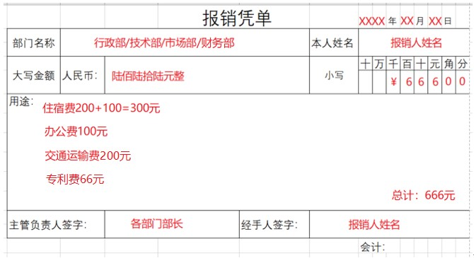
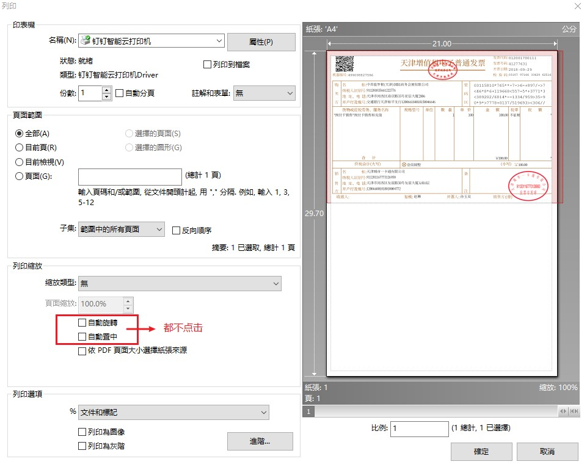
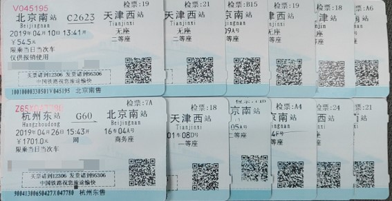
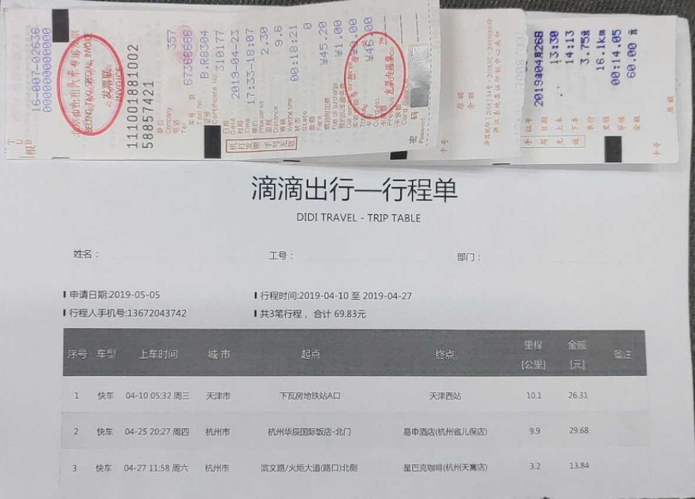

# 天津橙子科技有限公司费用报销管理制度简版
## 报销单
### 报销单的填写

1. 本人姓名与经手人同为报销人姓名。

2. 报销人为部长的，主管负责人需要运营委员会其他成员签字。

3. 报销经费用途分为以下类别：
- 办公费
- 餐饮费（出差途中报销制度限额内餐费）
- 住宿费
- 交通运输费
- 业务招待费
- 其它专项经费（填写明细）

4. 用途一栏需要按类别填写，涉及外地差旅费报销支出须注明项目或往返地点。

5. 报销单填写应力求整洁美观，不得随意涂改。

6. 大写数字规范：壹 贰 叁 肆 伍 陆 柒 捌 玖 拾 佰 仟 万 亿

### 示例
若某次报销金额为666元，共有3张不同事项的发票需要报销，则报销单的填写如下所示。

### 报销单的上报时间

财务部门仅**每周周五**以及**每月最后3个工作日**收取报销单以及发票，其余时间原则上不受理报销事务，必须提前申请。

### 报销单流程

报销人填写报销凭单→部门负责人审批→会计主管审核报销凭证→财务负责人审批→总经理审批→出纳审核并付款→报销人领款签字
​​
## 发票
### 发票要求

1. 增值税发票内容应按照实际销售情况如实开具，不得根据购买方要求填开与实际交易不符的内容，开具不实的发票。

2. 发票内容需要与企业日常经营活动相关，日常工作中主要的业务包括但不限于实物资产、租金发票、业务招待费、差旅费、会议费、工资薪金、运费、油费、水电费，发票需注明购买方名称、纳税人识别号、加盖发票专用章、开具税率正确，避免出现假票现象。固定资产、对外业务等各类别发票应尽量取得增值税专用发票，否则需在开具发票前通知财务。

3. 增值税发票，若带有清单，清单需要是从防伪税控系统开具打印出来的，否则不能报销，例如开具汇总办公用品等发票，必须附上税控系统开出的《销售货物或者提供应税劳务清单》，外加盖上发票专用章；开具培训会议清单，必须由酒店系统或销售系统开具，并加盖发票专用章，不再接受系统外开具的清单。

4. 收费公路通行费增值税电子普通发票；桥、闸通行费发票；旅客运输凭证（增值税电子普通发票，注明旅客身份信息的航空运输电子客票行程单、票价及燃油附加费，注明旅客身份信息的铁路车票，注明旅客身份信息的公路、水路等其他客票）需要在报销经费类别交通运输费内分项单独列示。

5. 当年发票，应在当年办理报销，跨年度的发票，不予报销。

### 发票规范

1. 除了增票和普票原件，其余的电子发票、行程单纸张打印大小至多为A5，大于A5的视作废票处理。

2. 对于增值税专用发票，报销时只粘贴发票联（棕色联），抵扣联（绿色联）直接上缴给财务负责人。

### 电子发票打印

1. 对于增值税电子发票的打印，要求一张A4纸打印不同的两张发票并裁开，如下图所示。

2. 打印的发票的边缘和内容必须完整，否则作废。

### 发票的粘贴

1. 报销单放置在所有发票上方。

2. 普票或普票的电子发票、增值税专用发票、飞机行程单，直接使用别针别在一起。
 
3. **火车、汽车票或者小张的打车票**，需要粘贴到一张或多张至多A5大小的白纸上紧靠粘贴单左上端，从左横向以鱼鳞式粘贴，相邻票据间须留出间隔距离，每张票据均保证贴在粘贴单上，不得以票贴票，不得集中在中间粘贴，不得将票据贴到粘贴单外，票据过多时可分行粘贴，不得竖向粘贴单张白纸上粘贴多张发票需在粘贴页右下角或背面注明发票用途、张数、总金额。
 

4. 不符合规定要求的报销单据，财务部有权退回，要求报销人重新整理。
