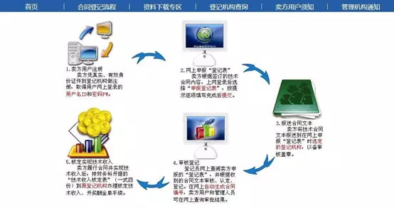

# 技术开发（委托）合同登记备案及办理免税指南
## 零、技术合同备案作用
### 0.1便于企业的合同管理及完善
完成登记的技术合同，科技部会自动生成一个合同编号，方便了企业对合同的管理，同时在科技部管理系统上备份的合同，也能提高合同的履约率，减少纠纷。

### 0.2享受技术市场税收优惠政策的前提
按照财政部国家税务总局颁布的：「财税【2016】36号文件（附件3）」中所阐述的内容，经科技部认定的技术开发合同，技术收益部分可免征增值税。
该文件的具体内容，可直接询问度娘。

### 0.3能够作为一些评审及考核的参考指标
认定登记的技术合同交易额是高新技术企业评审技术性收入核定的考核依据，同时技术合同登记的数量和金额也是企业科技项目参与评奖的重要参考指标。

按照「全国技术合同网上登记系统」所公示的要求，各地的技术合同登记流程以及报送材料应该一致，但也不排除各个地方科委可能存在的附加规定。

本公司位于天津市西青区，本文的办理指南为亲身体验的流程，仅做参考。

​​
### 0.4咨询电话
西青区科委负责劳动合同备案的科室电话： 022-27390157

## 一、卖方注册登记（已完成）
首次进行技术合同登记的企业，需要先进行卖方注册。需要将以下材料上报至企业所在地地级科委负责技术合同备案的科室。

具体科室信息在全国技术合同网上登记系统-登记机构查询页面进行查询。

### 1.1《卖方注册信息表》×1
进入「全国技术合同网上登记系统-资料下载专区」页面，下载009《卖方注册信息表》并正确填写，填写方式可参考下表。并在卖方名称处加盖公章。

后文中提到的一些表格或者需要查看的一些信息，都可以在上方链接所指向的网页中找到。

​
### 1.2营业执照副本复印件×1
加盖公章。

### 1.3法人身份证复印件×1
材料提交完成之后，一般是当场审核。审核通过之后，就可以在网上登记系统上用卖方注册信息表上的ID和密码登录了。
建议准备几份《技术合同卖方注册信息表》空表。

## 二、在线合同登记申请
在报送纸质合同之前，先要进行在线合同登记申请。按照以下步骤完成即可。

### 2.1登录网上登记系统
注册登记通过后，可进入「全国技术合同网上登记系统」页面，选择合同卖方登录，使用卖方注册信息表上的ID和密码登录。
账户：orchange   密码：*******

### 2.2合同申请
按照实际签订的合同的信息，填写合同登记申请的相关内容。
只有将步骤三也就是合同、登记表报送之后，审核员才会开始进行网上审核。因此网上填报过程中，有不确定的地方，建议最好事先与审核部门沟通，以免驳回重填。
可以对填写的内容进行暂存或者提交。提交之后也可以进行改动。

## 三、报送合同文本
### 3.1上报文件
网上申报结束之后，需要将以下材料上报至企业所在地地级科委负责技术合同备案的科室。

#### 1、合同文本×3

合同文本需要盖章的三个地方。
- 首页：双方的公章
- 签订页：双方的公章以及法人签名和法人章
- 整套文本：骑缝章

若任一方法人指定专门项目联系人来处理事务，也需要联系人签名并盖章，并且需要一份法人签字盖章的委托说明。
科技部模板合同只要未画横线的文字部分，不能删除，若实在不符合合同双方的需求可在合同最后一条中添加说明（比如有些企业需要把双方开票信息具体体现在合同中，可加在最后一条）。

**注意，第十五条关于合同标的物为软件产品的，该产品的专利归属，一定要是「甲方（买方）」或者「双方共有」，否则不能被认定为技术开发（委托）合同。**

这是我踩过的一个大坑……最后还弄得重签合同，相当麻烦。

#### 2、与认定合同有关的其他证明材料×1
双方营业执照复印件。
若任一方法人指定专门项目联系人来处理事务，法人代表或组织负责人书面授权证明原件。

## 四、核定实现技术收入
如果只是想要完成技术合同登记而不做免税的话，则Step3即为最后一个步骤。Step4是要完成免税所需完成的关键步骤。

### 4.1上报文件
#### 1、技术收入核定表×3
进入资料下载专区页面，下载012《技术收入核定表》并正确填写，可参考下表。

计算公式如下：
- 科委规定：**本次实现技术交易额=劳务费+原材料费+燃料及动力费+设备购置及使用费+专用业务费+一二级管理费+本次实现技术收入。**
- 公司规定：**本次实现技术交易额=本次实现合同交易额×0.95**

假设是分三期付款的合同，则需要上报三次核定表，并且三次的合同交易额以及技术交易额之和要分别与各自的总金额相同。其中只有技术交易额的部分可以免征增值税。

### 4.2回收文件
#### 1、技术合同技术收入核定表 ×2

#### 2、技术合同认定登记证明 ×2
审核完成之后，负责登记的科室会留存一份盖完章的收入核定表及登记证明，如下图所示，并将下列文件交与企业留底并继续减免税的流程。

**对于分N期付款的合同，需要在科委备案N次，获取N次技术合同登记证明。**

至此，在科委办理的技术合同登记流程全部结束。接下来需要去税务局办理合同登记。

## 五、办理减免税
繁琐的技术合同登记办理完成之后，技术合同减免税流程就要简单很多了，将以下材料上报至企业所在地国税局即可。

### 5.1技术合同认定登记证明×1
从步骤四获取的登记证明，一份企业自己留底，一份交与税务局。

### 5.2技术开发（委托）合同复印件×1
和登记证明上记录的同一份合同的复印件。如果是分期付款的合同，只需要上交新的登记证明即可，合同无须重复提交（但尽量带一份备用）。合同需要在封面盖上公章以及骑缝章。

### 5.3授权委托书×1
按照下表填写。需要盖上公章和法人章。

### 5.4受托人身份证复印件×1
需要加盖公章。

### 5.5纳税人减免税备案登记表×2

税务部门收取5.1-5.4的文件之后，会当场进行合同的录入。
录入完之后系统会现场生成并打印纳税人减免税备案登记表，必须要带上公章和法人章。该表一式两份，国税局留存一份，公司留存一份。
对于分N期付款的合同，只需要在税务局做一次备案登记即可。